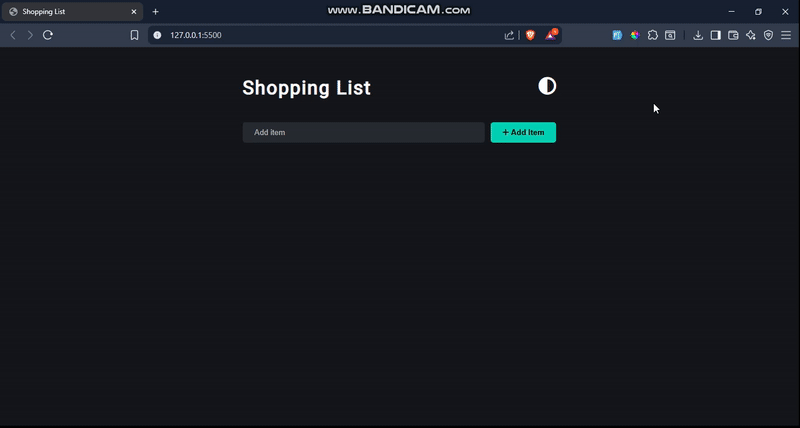

# 🛒 Shopping List App

A sleek and interactive shopping list application built with **Vanilla JavaScript**, **HTML** and **CSS**. It allows users to add, update, delete and filter items from the list with support for **light/dark** themes. The application uses **local storage**, so the list remains available even after a page refresh.

## 🎥 Demo



---

## ✨ Features

- ✅ **Add Items** — Add items with a single click.
- 📝 **Edit Items** — Update item names with an intuitive edit mode.
- 🗑️ **Delete Items** — Remove items individually with confirmation.
- 🚮 **Clear All** — Remove all items at once.
- 🔍 **Live Filter** — Search through your list as you type.
- 💾 **Local Storage** — List is saved even after refreshing or closing the browser.
- 🎨 **Theme Toggle** — Switch between light and dark themes.
- 🚫 **Duplicate Prevention** — Prevents adding the same item twice.
- 🛡️ **Validation** — Ensures item names are between 3–20 characters.

---

## 🛠️ Tech Stack

<p>
  
  
  
  
</p>

---

## 📦 Getting Started

No installation required — just open the `index.html` file in your browser.

```bash
git clone https://github.com/Umairulislam/shopping-list-app.git
cd shopping-list-app
open index.html
```
