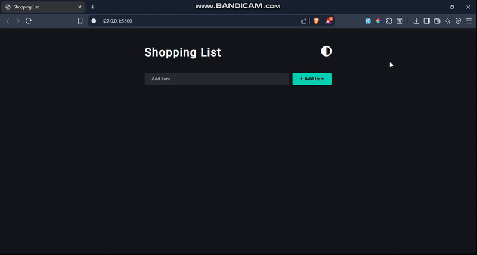

# 🛒 Shopping List App

A sleek and interactive shopping list application built with **Vanilla JavaScript**, **HTML**, and **CSS**.  
It allows users to **add, update, delete, and filter items** with support for **light/dark themes**.  
The app uses **local storage**, so your list remains available even after a page refresh.  

## 🎥 Demo



## 💡 Features

- ✅ **Add Items** — Add items with a single click.
- 📝 **Edit Items** — Update item names with an intuitive edit mode.
- 🗑️ **Delete Items** — Remove items individually with confirmation.
- 🚮 **Clear All** — Remove all items at once.
- 🔍 **Live Filter** — Search through your list as you type.
- 💾 **Local Storage** — List is saved even after refreshing or closing the browser.
- 🎨 **Theme Toggle** — Switch between light and dark themes.
- 🚫 **Duplicate Prevention** — Prevents adding the same item twice.
- 🛡️ **Validation** — Ensures item names are between 3–20 characters.

## 🛠️ Tech Stack

  
  
  
  

## 🚀 Getting Started

To run it locally in your machine follow these steps

1. Clone the repository
   ```bash
   git clone https://github.com/Umairulislam/shopping-list-app.git
   cd shopping-list-app
   ```
2. Open with live server or open `index.html` in your browser.

## 👨‍💼 Author

Crafted with care by **Engr. Umair Ul Islam**
